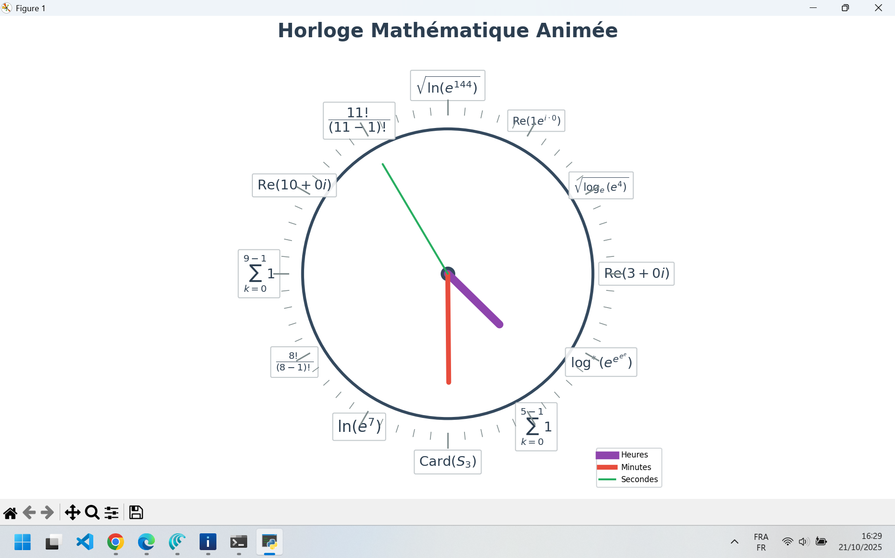

# MathClockRealTime 
 
MathClockRealTime est une horloge graphique avancée animée en temps réel où chaque heure est affichée sous forme d'expressions mathématiques variées (logarithmes, racines, fonctions trigonométriques, intégrales, sommes, etc.). Ce projet combine la puissance de la bibliothèque SymPy pour générer des expressions exactes et matplotlib pour l’affichage dynamique et fluide. 
 
--- 
 
## Table des matières 
- [Fonctionnalités](#fonctionnalités) 
- [Prérequis](#prérequis) 
- [Installation et exécution](#installation-et-exécution) 
- [Captures d'écran](#captures-d'écran) 
- [Structure du projet](#structure-du-projet) 
- [Utilisation de Git et création du dépôt GitHub](#utilisation-de-git-et-création-du-dépôt-github) 
- [Note](#note) 
- [Contribution](#contribution) 
- [Licence](#licence) 
 
--- 
 
## Fonctionnalités 
 
- Affichage des heures 1 à 12 sous forme d’expressions mathématiques aléatoires et exactes. 
- Aiguilles heures, minutes et secondes animées en temps réel avec fluidité. 
- Affichage LaTeX des expressions pour une lecture mathématique claire. 
- Support d’environnements Linux graphiques, avec possibilité d’adaptation sous Termux Android via serveur X11. 
 
--- 
 
## Prérequis 
 
- Python 3 
- Bibliothèques Python : `sympy`, `matplotlib`, `numpy` 
 
Vous pouvez les installer avec pip : 
 
``` 
pip install sympy matplotlib numpy 
``` 
 
Sous Termux Android, il est recommandé d’installer un serveur X11 (comme XServer XSDL) pour permettre l’affichage graphique matplotlib. 
 
--- 
 
## Installation et exécution 
 
Clonez ou créez un dossier pour le projet : 
 
``` 
mkdir MathClockRealTime 
cd MathClockRealTime 
``` 
 
Placez le fichier `MathClockRealTime.py` dans ce dossier. 
 
Pour lancer l’horloge : 
 
``` 
python3 MathClockRealTime.py 
``` 
 
--- 
 
## Captures d'écran 
Voici des exemples de l'horloge en action : 
 
 
 
--- 
 
## Structure du projet 
Voici l'arborescence des dossiers et fichiers du projet : 
 
``` 
. 
├── LICENSE.md 
├── MathClockRealTime.py 
├── MathClockRealTime_backup.py 
├── README.md 
├── README_backup.md 
├── alt.py 
├── alt_backup.py 
├── assets 
│   ├── clock.png 
│   └── clock2.png 
├── clock.py 
└── clock_backup.py 
 
1 directory, 11 files 
``` 
 
--- 
 
## Utilisation de Git et création du dépôt GitHub 
 
Initialisez un dépôt Git local : 
 
``` 
git init 
git add MathClockRealTime.py 
git commit -m "Initial commit - Horloge Mathématique animée en temps réel" 
``` 
 
Créez un nouveau dépôt GitHub en ligne via GitHub CLI (assurez-vous d’être connecté `gh auth login`) : 
 
``` 
gh repo create MathClockRealTime --public --description "Horloge animée en temps réel affichant heures sous forme d'expressions mathématiques avancées" 
``` 
 
Poussez votre code vers GitHub : 
 
``` 
git branch -M main 
git remote add origin https://github.com/votre_utilisateur/MathClockRealTime.git 
git push -u origin main 
``` 
 
--- 
 
## Note 
 
Cette horloge fonctionne parfaitement sur ordinateurs avec interface graphique X11. Sous Termux Android, configurez un serveur X11 externe (ex : XServer XSDL) pour afficher la fenêtre matplotlib. 
 
--- 
 
## Contribution 
 
Contributions, idées et améliorations sont les bienvenues ! 
 
--- 
 
## Licence 
 
Ce projet est sous licence MIT. Voir le fichier [LICENSE.md](LICENSE.md) pour plus de détails. 
 
--- 
 
Bon codage avec **MathClockRealTime** ! 
